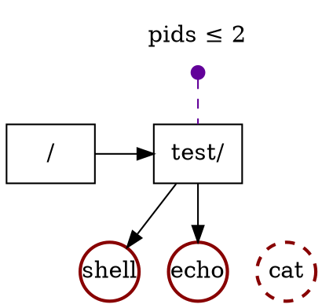

A system has hundreds of resources that process may use (and exhaust!):
controlling them it is not trivial and requires a precise intervention
by part of the kernel.

We'll use the simplest resource to understand: the amount of process
ids or pids.

While CPU and memory are the most common resources that can be
exhausted, the process id *space* is not infinite: it is an integer
typically in the range of 1 to `2^{16}`{.mathjax}.


```
Not of use.
```


A malicious or really-bugged program can trivially consume all the
available pids spawning thousands of processes and threads *long before*
other resource get exhausted. This the so called *fork bomb*.


Once you run out of pids, no other process can be started leaving the system
unusable.


Previous post: [hierarchical organization](/articles/2022/04/23/Linux-Control-Group-Hierarchical-Organization.html)
<br />
Next coming post: [no internal process constraint](/articles/2022/04/27/Linux-Control-Group-No-Internal-Process-Constraint.html)


In this post we will explore the rules of resources distribution in a
`cgroup` hierarchy and in particular how to avoid fork bombs to explode.
<!--more-->

<!--
$ test -d /sys/fs/cgroup/test && echo "cgroup test/ already created!"     # byexample: +fail-fast
-->

## Limit the resource (pid count) on a cgroup


```dot
digraph CG  {
    bgcolor="transparent";

    // Controllers
    node [shape=none] {
        "pids" [label="pids ≤ max"];
    }

    // Domains
    node [shape=box, color="#000000", style=solid] {
        "test" [label="test/"];
        "root" [label="/"];
    }

    // Processes
    node [shape=circle,  color="#880000", style=bold, width=0.5, fixedsize=true] {
        "shell" [label="shell"];
    }

    // Cgroups at top
    {rank=min; pids}
    {rank=same; root test}

    // Processes and threads at bottom
    {rank=max; shell}

    pids -> test [style=dashed, arrowtail=dot, dir=back, color="#620099"];

    root -> test [minlen=2];
    test -> shell;
}
```
`cgroup` hierarchy after adding the `shell` process to `test/`.
<br />
Boxes represent cgroups and the arrows between the nesting (here, `test/` is
inside of the root `/` cgroup). Circles are processes and the small purple
dots are the resource controller's setting (the limit of pids in this
case).


Let's create a `test/` cgroup:

```shell
$ cd /sys/fs/cgroup
$ mkdir test
```

Let's add ourselves to `test/`: we add the *shell process* to `test/` by
adding its process id into `cgroup.procs` file.

```shell
$ echo $$ > test/cgroup.procs
```

Now we can query how many pids are being used in the cgroup. The
expected count is 2: one for the shell that we added and other for the
`cat` program that it is reading `pids.current`:

```shell
$ cat test/pids.current
2
```



`cgroup` hierarchy during the execution of `echo "Hello" | cat`.
Both `echo` and `cat` are children of `shell` so they inherit
the parent's cgroup by default but due the limit on `pids ≤ 2`,
the spawn of `cat` fails (the `fork` syscall fails) and the process
never gets alive.


The `+pids` controller allows us to set a maximum: once reached calls to
`fork` or `clone` will fail because they will not be able to reserve another
pid.

```shell
$ echo 2 > test/pids.max

$ echo "Hello"
Hello

$ echo "Hello" | cat        # byexample: +timeout=30
<...>fork: Resource temporarily unavailable
```

## Resource distribution over a subtree



```dot
digraph CG  {
    bgcolor="transparent";

    // Controllers
    node [shape=none] {
        "pids" [label="pids ≤ 2"];
    }

    // Domains
    node [shape=box, color="#000000", style=solid] {
        "test" [label="test/"];
        "root" [label="/"];
        "cg1" [label="cg1/", group=lvl1];
        "cg2" [label="cg2/", group=lvl1];
    }

    // Processes
    node [shape=circle,  color="#880000", style=bold, width=0.5, fixedsize=true] {
        "shell" [label="shell"];
    }

    // Failed processes
    node [shape=circle,  color="#880000", style="dashed,bold", width=0.5, fixedsize=true] {
    }

    // Cgroups at top
    {rank=min; pids}
    {rank=same; root test cg1}

    // Processes and threads at bottom
    {rank=max; shell cg2}

    pids -> test [style=dashed, arrowtail=dot, dir=back, color="#620099"];

    root -> test [minlen=2];
    test -> shell;
    test -> cg1;
    test -> cg2;

    cg1 -> cg2 [style=invis];
}
```
Notice how `test/cg1/` and `test/cg2/` are (sub) cgroups of `test/`.


We can divide `test/` in more sub cgroups however there are no `pids.max`
there by default:

```shell
$ mkdir test/cg1
$ mkdir test/cg2

$ ls -1 test/cg1/pids*
<...>No such file or directory

$ ls -1 test/cg2/pids*
<...>No such file or directory
```

Each new (sub) cgroup will *not* inherit the controllers of its
parent. The parent must explicitly select which controllers its children
will administrate.

Nevertheless, the sub cgroups are subject to the limits of the
controller.


```dot
digraph CG  {
    bgcolor="transparent";

    // Controllers
    node [shape=none] {
        "pids" [label="pids ≤ 2"];
    }

    // Domains
    node [shape=box, color="#000000", style=solid] {
        "test" [label="test/"];
        "root" [label="/"];
        "cg1" [label="cg1/", group=lvl1];
        "cg2" [label="cg2/", group=lvl1];
    }

    // Processes
    node [shape=circle,  color="#880000", style=bold, width=0.5, fixedsize=true] {
        "shell" [label="shell", group=lvl1];
        "echo" [label="echo"];
    }

    // Failed processes
    node [shape=circle,  color="#880000", style="dashed,bold", width=0.5, fixedsize=true] {
        "cat" [label="cat"];
    }

    // Cgroups at top
    {rank=min; pids}
    {rank=same; root test cg1}

    {rank=max; cg2}

    pids -> test [style=dashed, arrowtail=dot, dir=back, color="#620099"];

    root -> test [minlen=2];
    test -> cg1;
    test -> cg2;

    cg1 -> shell;
    cg1 -> echo;
    cg1 -> cat [style=invis];

    shell -> cg2 [style=invis];
}
```
Despite +pids not be enabled on test/cg1/ the limit imposed by test/
*still applies*.
<br />
Notice also that writing shell's pid to `test/cg1/cgroup.procs`
literally moved it from `test/` to `test/cg1/`: *each process belongs
to one and only one cgroup*.



To prove this, let's move our shell to `test/cg1/` and try to spawn
more than 2 processes there.

```shell
$ echo $$ > test/cg1/cgroup.procs
$ cat test/cgroup.procs

$ # the limit of 2 processes on test/ applies to test/'s children too
$ echo "Hello" | cat        # byexample: +timeout=30
<...>fork: Resource temporarily unavailable
```

In fact the whole subtree works as *single unit*: the *sum* of the
consumed resources by the processes in the subtree is subject to
the limits of the controller.

Let's extend the limit to 3 processes, create a long running
process in `test/cg2/` and try to spawn more processes on `test/cg1/` as
before.


While neither the amount of processes in `test/cg1/` nor `test/cg2/` exceed
the limit of 3 processes, *the sum does*.



```dot
digraph CG  {
    bgcolor="transparent";

    // Controllers
    node [shape=none] {
        "pids" [label="pids ≤ 3"];
    }

    // Domains
    node [shape=box, color="#000000", style=solid] {
        "test" [label="test/"];
        "root" [label="/"];
        "cg1" [label="cg1/", group=lvl1];
        "cg2" [label="cg2/", group=lvl1];
    }

    // Processes
    node [shape=circle,  color="#880000", style=bold, width=0.5, fixedsize=true] {
        "shell" [label="shell", group=lvl1];
        "echo" [label="echo"];
        "sleep" [label="sleep"];
    }

    // Failed processes
    node [shape=circle,  color="#880000", style="dashed,bold", width=0.5, fixedsize=true] {
        "cat" [label="cat"];
    }

    // Cgroups at top
    {rank=min; pids}
    {rank=same; root test cg1}

    {rank=max; sleep}

    pids -> test [style=dashed, arrowtail=dot, dir=back, color="#620099"];

    root -> test [minlen=2];
    test -> cg1;
    test -> cg2;

    cg1 -> shell;
    cg1 -> echo;
    cg1 -> cat [style=invis];

    shell -> cg2 [style=invis];

    cg2 -> sleep;
}
```


```shell
$ # limit on our parent (test/)
$ echo 3 > test/pids.max

$ # we can spawn 2 processes without problem
$ # because we under the limit (2+1 <= 3)
$ echo "Hello" | cat
Hello

$ # let's add a process to our sibling (test/cg2)
$ sleep 1000 &
[<job-id-proc1>] <pid-proc1>
$ echo <pid-proc1> > test/cg2/cgroup.procs      # byexample: +paste

$ # limit exceeded: our shell, the sleep process and these
$ # 2 spawned processes exceeds the limit of 3 for the whole
$ # subtree of test/
$ echo "Hello" | cat        # byexample: +timeout=30
<...>fork: Resource temporarily unavailable
```

## Further resource distribution: top-down constraint

Having sub cgroups makes more sense if we enable controllers there
allowing us to have a better discretion to distribute the resources.


```dot
digraph CG  {
    bgcolor="transparent";

    // Controllers
    node [shape=none] {
        "pids" [label="pids ≤ 3"];
        "pidscg1" [label="pids ≤ max"];
        "pidscg2" [label="pids ≤ max"];
    }

    // Domains
    node [shape=box, color="#000000", style=solid] {
        "test" [label="test/"];
        "root" [label="/"];
        "cg1" [label="cg1/", group=lvl1];
        "cg2" [label="cg2/", group=lvl1];
    }

    // Processes
    node [shape=circle,  color="#880000", style=bold, width=0.5, fixedsize=true] {
        "shell" [label="shell", group=lvl1];
    }

    // Failed processes
    node [shape=circle,  color="#880000", style="dashed,bold", width=0.5, fixedsize=true] {
    }

    // Cgroups at top
    {rank=min; pids pidscg1}
    {rank=same; root test cg1}

    {rank=max; pidscg2}

    pids -> test [style=dashed, arrowtail=dot, dir=back, color="#620099"];
    pidscg1 -> cg1 [style=dashed, arrowtail=dot, dir=back, color="#620099"];

    root -> test [minlen=2];
    test -> cg1;
    test -> cg2;

    cg1 -> shell;

    shell -> cg2 [style=invis];

    cg2 -> pidscg2 [style=dashed, arrowhead=dot, color="#620099"];
}
```
Writing to `+pids` to `test/cgroup.subtree_control` enables the
resource controller on the immediate children.


If we want to define (sub) limits in the `test/` immediate children, we
need to *enable the `+pids` controller on the subtree*.


```shell
$ # kill the sleep process, not of much interest from now on
$ kill -15 <pid-proc1>                          # byexample: +paste +pass

$ # enable the controller to the test/ children
$ echo '+pids' > test/cgroup.subtree_control
```

The `cgroup.subtree_control` lists which controllers the immediate
children will have access and control over.

```shell
$ ls -1 test/cg1/pids*
test/cg1/pids.current
test/cg1/pids.events
test/cg1/pids.max

$ ls -1 test/cg2/pids*
test/cg2/pids.current
test/cg2/pids.events
test/cg2/pids.max
```

By default the sub cgroups will have no limit on *their* `pids.max` file
but the are still subject to the limit set in `test/`.

```shell
$ cat test/cg1/pids.max      # apparently no limit on the child (test/cg1)
max

$ echo "Hello" | cat | cat   # byexample: +timeout=30
<...>fork: Resource temporarily unavailable
```


```dot
digraph CG  {
    bgcolor="transparent";

    // Controllers
    node [shape=none] {
        "pids" [label="pids ≤ 6"];
        "pidscg1" [label="pids ≤ 2"];
        "pidscg2" [label="pids ≤ max"];
    }

    // Domains
    node [shape=box, color="#000000", style=solid] {
        "test" [label="test/"];
        "root" [label="/"];
        "cg1" [label="cg1/", group=lvl1];
        "cg2" [label="cg2/", group=lvl1];
    }

    // Processes
    node [shape=circle,  color="#880000", style=bold, width=0.5, fixedsize=true] {
        "shell" [label="shell", group=lvl1];
        "echo" [label="echo"];
    }

    // Failed processes
    node [shape=circle,  color="#880000", style="dashed,bold", width=0.5, fixedsize=true] {
        "cat" [label="cat"];
    }

    // Cgroups at top
    {rank=min; pids pidscg1}
    {rank=same; root test cg1}

    {rank=max; pidscg2}

    pids -> test [style=dashed, arrowtail=dot, dir=back, color="#620099"];
    pidscg1 -> cg1 [style=dashed, arrowtail=dot, dir=back, color="#620099"];

    root -> test [minlen=2];
    test -> cg1;
    test -> cg2;

    cg1 -> shell;
    cg1 -> echo;
    cg1 -> cat [style=invis];

    shell -> cg2 [style=invis];

    cg2 -> pidscg2 [style=dashed, arrowhead=dot, color="#620099"];
}
```



The controller can never enlarge or relax the limits on the resource
*beyond* the limits given by the parent,
it can only *restrict* it further.

This is the *top-down constraint*.

So let's try that!

```shell
$ # limit on the parent (test/)
$ echo 6 > test/pids.max

$ # we can perfectly spawn these two process now
$ echo "Hello" | cat
Hello

$ # limit further on the child (cg1/)
$ echo 2 > test/cg1/pids.max

$ # now we can't: we are hitting the limit not of test/ but of test/cg1/
$ echo "Hello" | cat        # byexample: +timeout=30
<...>fork: Resource temporarily unavailable
```


## Explosion contained


[Fork bomb reference](https://en.wikipedia.org/wiki/Fork_bomb).


Not really sure why, but a fork bomb in my machine tends to eat all the CPU
so it is not just eating all the pids.

Thankfully, there is a resource controller for the CPU in `cgroup` too.

```shell
$ echo 3 > test/pids.max                # byexample: +fail-fast
$ echo "1000 100000" > test/cpu.max     # byexample: +fail-fast

$ echo max > test/cg1/pids.max

$ bomb() {
>  bomb | bomb
> }

$ bomb       # byexample: +timeout=90
<...>Resource temporarily unavailable<...>
```

After a few experiments I would say that the `+pids` controller is by no
means the only measure to take to contain a fork explosion. Without
`+cpu` I melted down my machine a few times.

Run the bomb under your responsibility!

## Further reading

With `+pids` we set a limit on a resource but *limiting* is just one
of other possible ways to control a resource.

We could set for *weights* to balance the resource usage between cgroups
or we could set minimum levels of a resource (*protection*) to mention a
few other ways to control a resource.

All of them are out of the scope for this post as well which
resources and controllers exist.


## Next stuff

In the
[past post](/articles/2022/04/23/Linux-Control-Group-Hierarchical-Organization.html)
 we talked about how we can organize the `cgroup`
hierarchy and in this post how we can control and distribute resources
over it.

But we talked little about where the processes should be put in the
hierarchy. It may seem that they could be put anywhere and for `v1` that
is true.

In `v2` however, the things will get a bit hairy and weird with the
[no internal process constraint](/articles/2022/04/27/Linux-Control-Group-No-Internal-Process-Constraint.html).


<!--
Move our shell(s) to the root
$ echo $$ > /sys/fs/cgroup/cgroup.procs                     # byexample: +pass -skip

Limit the test/ cgroup in case the bomb is still exploding and
it is out of control
$ echo 0 > /sys/fs/cgroup/test/pids.max                     # byexample: +pass -skip
$ echo "1000 100000" > /sys/fs/cgroup/test/cpu.max          # byexample: +pass -skip

Kill any subprocess
$ kill -9 $(jobs -p) && wait                                    # byexample: -skip +pass
$ sleep 2                                                       # byexample: -skip +pass +timeout=8
$ kill -9 $(cat /sys/fs/cgroup/test/cg1/cgroup.procs) && wait   # byexample: -skip +pass
$ kill -9 $(cat /sys/fs/cgroup/test/cg2/cgroup.procs) && wait   # byexample: -skip +pass
$ kill -9 $(cat /sys/fs/cgroup/test/cgroup.procs) && wait       # byexample: -skip +pass
$ sleep 2                                                       # byexample: -skip +pass +timeout=8

$ echo '-pids' > /sys/fs/cgroup/test/cgroup.subtree_control     # byexample: -skip +pass

Delete recursively every cgroup (folder) from the leaves to the
root. All of them should be empty by now
$ cd /sys/fs/cgroup/                                     # byexample: +pass -skip
$ rmdir $(find /sys/fs/cgroup/test/ -type d | sort -r)   # byexample: +pass -skip
-->
