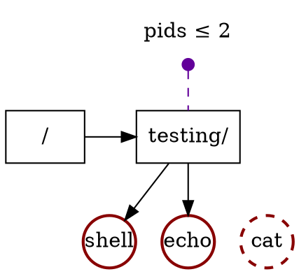

In this post we will explore the rules of resources distribution in a
`cgroup` hierarchy.

We'll use the simplest resource to control: the amount of process
ids or pids.

While CPU and memory are the most common resources that can be
exhausted, the process id *space* is not infinite: it is an integer
typically in the range of 1 to `2^{16}`{.mathjax}.


[Fork bomb reference](https://en.wikipedia.org/wiki/Fork_bomb).


A malicious or really-bugged program can trivially consume all the
available pids spawning thousands of processes and threads. This the so
called fork bomb.

Once exhausted, no other process can be started leaving the system
unusable.

At difference with CPU and memory, exhausting the pids space is very easy.

So in this post we will explore how to control this resource using
`cgroup`.

## Limit the resource (pid count) on a cgroup

Let's create a `testing/` cgroup:

```shell
$ cd /sys/fs/cgroup
$ mkdir testing

$ cd testing
```


```dot
digraph CG  {
    bgcolor="transparent";

    // Controllers
    node [shape=none] {
        "pids" [label="pids ≤ max"];
    }

    // Domains
    node [shape=box, color="#000000", style=solid] {
        "testing" [label="testing/"];
        "root" [label="/"];
    }

    // Processes
    node [shape=circle,  color="#880000", style=bold, width=0.5, fixedsize=true] {
        "shell" [label="shell"];
    }

    // Cgroups at top
    {rank=min; pids}
    {rank=same; root testing}

    // Processes and threads at bottom
    {rank=max; shell}

    pids -> testing [style=dashed, arrowtail=dot, dir=back, color="#620099"];

    root -> testing [minlen=2];
    testing -> shell;
}
```
`cgroup` hierarchy after adding the `shell` process to `testing/`.
<br />
Boxes represent cgroups and the arrows between the nesting (here, `testing/` is
inside of the root `/` cgroup). Circles are processes the small purple
dot are the resource controller's setting (in this case `pids`).


Let's add ourselves to `testing/`: we add the shell process adding its
process id into `cgroup.procs` file.

```shell
$ echo $$ > cgroup.procs
```

Now we can query how many pids are being used in the cgroup. The
expected count is 2: one for the shell that we added and other for the
`cat` program that it is reading `pids.current`:

```shell
$ cat pids.current
2
```

The `pids` controller allows us to set a maximum: once reached calls to
`fork` or `clone` will fail because they will not be able to reserve another
pid.



`cgroup` hierarchy during the execution of `echo "Hello" | cat`.
Both `echo` and `cat` are children of `shell` so they inherit
the parent's cgroup by default but due the limit on `pids ≤ 2`,
the spawn of `cat` fails (the `fork` syscall fails) and the process
doesn't exist really.


```shell
$ echo 2 > pids.max

$ echo "Hello"
Hello

$ echo "Hello" | cat        # byexample: +timeout=30
<...>fork: Resource temporarily unavailable
```

## Resource (pids) control over a cgroup subtree

Let's restore the pids limit and let's create two (sub) cgroups:

```shell
$ echo max > pids.max

$ mkdir cg1
$ mkdir cg2
```


```dot
digraph CG  {
    bgcolor="transparent";

    // Controllers
    node [shape=none] {
        "pids" [label="pids ≤ max"];
    }

    // Domains
    node [shape=box, color="#000000", style=solid] {
        "testing" [label="testing/"];
        "root" [label="/"];
        "cg1" [label="cg1/", group=lvl1];
        "cg2" [label="cg2/", group=lvl1];
    }

    // Processes
    node [shape=circle,  color="#880000", style=bold, width=0.5, fixedsize=true] {
        "shell" [label="shell"];
    }

    // Failed processes
    node [shape=circle,  color="#880000", style="dashed,bold", width=0.5, fixedsize=true] {
    }

    // Cgroups at top
    {rank=min; pids}
    {rank=same; root testing cg1}

    // Processes and threads at bottom
    {rank=max; shell cg2}

    pids -> testing [style=dashed, arrowtail=dot, dir=back, color="#620099"];

    root -> testing [minlen=2];
    testing -> shell;
    testing -> cg1;
    testing -> cg2;

    cg1 -> cg2 [style=invis];
}
```
Notice how `cg1` and `cg2` are (sub) cgroups of `testing/`.


However there are no `pids.max` in the new cgroups:

```shell
$ ls -1 cg1/pids*
<...>No such file or directory

$ ls -1 cg2/pids*
<...>No such file or directory
```

Each new (sub) cgroup will *not* inherit the controllers of its
parent. The parent must explicitly select which controllers its children
will administrate.

Let's move our shell to `cg1/` and activate the `pids` controller on it
(on all the direct children of `testing/`)


```dot
digraph CG  {
    bgcolor="transparent";

    // Controllers
    node [shape=none] {
        "pids" [label="pids ≤ max"];
        "pidscg1" [label="pids ≤ max"];
        "pidscg2" [label="pids ≤ max"];
    }

    // Domains
    node [shape=box, color="#000000", style=solid] {
        "testing" [label="testing/"];
        "root" [label="/"];
        "cg1" [label="cg1/", group=lvl1];
        "cg2" [label="cg2/", group=lvl1];
    }

    // Processes
    node [shape=circle,  color="#880000", style=bold, width=0.5, fixedsize=true] {
        "shell" [label="shell", group=lvl1];
    }

    // Failed processes
    node [shape=circle,  color="#880000", style="dashed,bold", width=0.5, fixedsize=true] {
    }

    // Cgroups at top
    {rank=min; pids pidscg1}
    {rank=same; root testing cg1}

    {rank=max; pidscg2}

    pids -> testing [style=dashed, arrowtail=dot, dir=back, color="#620099"];
    pidscg1 -> cg1 [style=dashed, arrowtail=dot, dir=back, color="#620099"];

    root -> testing [minlen=2];
    testing -> cg1;
    testing -> cg2;

    cg1 -> shell;

    shell -> cg2 [style=invis];

    cg2 -> pidscg2 [style=dashed, arrowhead=dot, color="#620099"];
}
```
Writing to `+pids` to `testing/cgroup.subtree_control` enables the
resource controller on the immediate children.


```shell
$ echo $$ > cg1/cgroup.procs
$ cat cgroup.procs

$ echo '+pids' > cgroup.subtree_control
```

Notice how the `cgroup.procs` of `testing/` gets empty when we write the
process id of our shell in a different cgroup (`testing/cg1/` in this
case).

The `cgroup.subtree_control` lists which controllers the immediate
children will have access and control over.

```shell
$ ls -1 cg1/pids*
cg1/pids.current
cg1/pids.events
cg1/pids.max

$ ls -1 cg2/pids*
cg2/pids.current
cg2/pids.events
cg2/pids.max
```

Now, let's impose a limit on the pids as before on `testing/`

As your intuition may say, limiting the resources on the parent
imposes a limit on the (sub) cgroups, even if they claim to have a
looser limit or not limit at all.


```dot
digraph CG  {
    bgcolor="transparent";

    // Controllers
    node [shape=none] {
        "pids" [label="pids ≤ 2"];
        "pidscg1" [label="pids ≤ max"];
        "pidscg2" [label="pids ≤ max"];
    }

    // Domains
    node [shape=box, color="#000000", style=solid] {
        "testing" [label="testing/"];
        "root" [label="/"];
        "cg1" [label="cg1/", group=lvl1];
        "cg2" [label="cg2/", group=lvl1];
    }

    // Processes
    node [shape=circle,  color="#880000", style=bold, width=0.5, fixedsize=true] {
        "shell" [label="shell", group=lvl1];
        "echo" [label="echo"];
    }

    // Failed processes
    node [shape=circle,  color="#880000", style="dashed,bold", width=0.5, fixedsize=true] {
        "cat" [label="cat"];
    }

    // Cgroups at top
    {rank=min; pids pidscg1}
    {rank=same; root testing cg1}

    {rank=max; pidscg2}

    pids -> testing [style=dashed, arrowtail=dot, dir=back, color="#620099"];
    pidscg1 -> cg1 [style=dashed, arrowtail=dot, dir=back, color="#620099"];

    root -> testing [minlen=2];
    testing -> cg1;
    testing -> cg2;

    cg1 -> shell;
    cg1 -> echo;
    cg1 -> cat [style=invis];

    shell -> cg2 [style=invis];

    cg2 -> pidscg2 [style=dashed, arrowhead=dot, color="#620099"];
}
```


```shell
$ echo 2 > pids.max     # limit on the parent (testing/)

$ cat cg1/pids.max      # apparently no limit on the child (testing/cg1)
max

$ echo "Hello" | cat    # byexample: +timeout=30
<...>fork: Resource temporarily unavailable
```


## Further resource distribution

The controller can never enlarge or relax the limits on the resource
*beyond* the limits given by the parent,
it can only *restrict* it further.

So let's try that!

```shell
$ echo 6 > pids.max         # limit on the parent (testing/)
$ echo 2 > cg1/pids.max     # limit further on the child (cg1/)

$ echo "Hello" | cat        # byexample: +timeout=30
<...>fork: Resource temporarily unavailable
```



```dot
digraph CG  {
    bgcolor="transparent";

    // Controllers
    node [shape=none] {
        "pids" [label="pids ≤ 6"];
        "pidscg1" [label="pids ≤ 2"];
        "pidscg2" [label="pids ≤ max"];
    }

    // Domains
    node [shape=box, color="#000000", style=solid] {
        "testing" [label="testing/"];
        "root" [label="/"];
        "cg1" [label="cg1/", group=lvl1];
        "cg2" [label="cg2/", group=lvl1];
    }

    // Processes
    node [shape=circle,  color="#880000", style=bold, width=0.5, fixedsize=true] {
        "shell" [label="shell", group=lvl1];
        "echo" [label="echo"];
    }

    // Failed processes
    node [shape=circle,  color="#880000", style="dashed,bold", width=0.5, fixedsize=true] {
        "cat" [label="cat"];
    }

    // Cgroups at top
    {rank=min; pids pidscg1}
    {rank=same; root testing cg1}
    {rank=same; shell echo cat}

    {rank=max; pidscg2}

    pids -> testing [style=dashed, arrowtail=dot, dir=back, color="#620099"];
    pidscg1 -> cg1 [style=dashed, arrowtail=dot, dir=back, color="#620099"];

    root -> testing [minlen=2];
    testing -> cg1;
    testing -> cg2;

    cg1 -> shell;
    cg1 -> echo;
    cg1 -> cat [style=invis];

    shell -> cg2 [style=invis];

    cg2 -> pidscg2 [style=dashed, arrowhead=dot, color="#620099"];
}
```


<!--
Remove any constraint on pids
$ echo max > /sys/fs/cgroup/testing/pids.max                # byexample: -skip +pass
$ echo max > /sys/fs/cgroup/testing/cg1/pids.max            # byexample: -skip +pass
$ echo max > /sys/fs/cgroup/testing/cg1/sub1/pids.max       # byexample: -skip +pass
$ echo max > /sys/fs/cgroup/testing/cg2/pids.max            # byexample: -skip +pass

$ echo '-pids' > /sys/fs/cgroup/testing/cgroup.subtree_control           # byexample: -skip +pass
$ sleep 5                                                   # byexample: -skip +pass +timeout=8

Kill any subprocess
$ kill -9 "$(jobs -p)" && wait                              # byexample: -skip +pass

Move our shell(s) to the root
$ echo $$ > /sys/fs/cgroup/cgroup.procs                     # byexample: +pass -skip

$ sleep 5                                                   # byexample: -skip +pass +timeout=8

Delete recursively every cgroup (folder) from the leaves to the
root. All of them should be empty by now
$ cd /sys/fs/cgroup/                                        # byexample: +pass -skip
$ rmdir $(find /sys/fs/cgroup/testing/ -type d | sort -r)   # byexample: +pass -skip
-->
