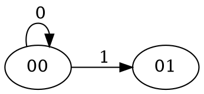
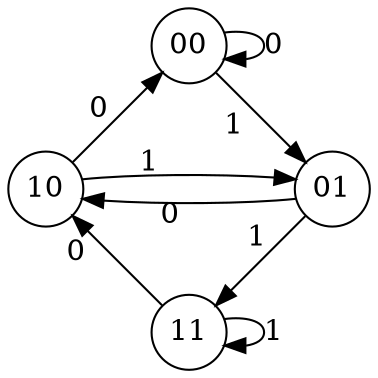

What have in common a dense arrays for mapping numbers power of 2
to some objects, DNA sequencing and brute-forcing the lock pad
of your neighbor?<!--more-->

## Substrings

Given an alphabet of `k`{.mathjax} symbols, you can build strings
of length `n`{.mathjax} from it.

For a binary alphabet `{0,1}`{.mathjax} these are the strings of length 4:

```
    0000    0100    1000    1100
    0001    0101    1001    1101
    0010    0110    1010    1110
    0011    0111    1011    1111
```

A set of elements like the strings above can be *classified*: choose
a *relationship* among the elements and build a class where all the
elements of the class have the same relation.

Mathematically, each class is defined as

```tex;mathjax
 C = { x \in X \vert a \sim x }   
```

Where `a`{.mathjax} is one element of the set `X`{.mathjax} that is used as a reference.

For example, we can classify the binary strings in two classes: the
ones that have its last bit equal to 0 and the ones which don't.

In other words: the even and the odd numbers.

```
    0000    0100    |    0001    0101
    0010    0110    |    0011    0111
    1000    1100    |    1001    1101
    1010    1110    |    1011    1111
```

In mathematics jargon, each class is an [equivalence
class](https://en.wikipedia.org/wiki/Equivalence_class) and the relation
used to group them is an [equivalence
relation](https://en.wikipedia.org/wiki/Equivalence_relation).

## Necklaces

The relation ` x \sim a `{.mathjax} is quite arbitrary; another relation could
be the strings of length 4 that are a *rotation* of another string.

This generates 6 classes:

```
    0000  |  0001  |  0011  |  0101  |  0111  |  1111
          |  0010  |  0110  |  1010  |  1101  |
          |  0100  |  1100  |        |  1011  |
          |  1000  |  1001  |        |  1110  |
```

Each [equivalence class](https://en.wikipedia.org/wiki/Equivalence_class)
generated from strings of length `n`{.mathjax} from an alphabet of `k`{.mathjax} elements
which [equivalence
relation](https://en.wikipedia.org/wiki/Equivalence_relation) is the
rotation has the special names of
[necklaces](https://en.wikipedia.org/wiki/Necklace_(combinatorics)).

The above 6 classes are 6 necklaces for `k=2`{.mathjax} and `n=4`{.mathjax}.

## Aperiodic necklaces

As you notice how many elements a necklace has varies. The necklace
generated from all the rotations of 0000 has only one element: {0000};
while the necklace generated from 0001 has 4 elements: {0001, 0010,
0100 and 1000}.

These are two extremes. A middle point is the necklace {0101, 1010}.

You see, if you pick a string and you start rotating it you may
find yourself with the same initial string **before** doing
a complete wrap-around.

Pick 0101, rotate it once and you get 1010, and once more and you
get the original 0101.

If you do the same with 0001 you will find that you need to perform
4 rotations to get the initial string.

An *aperiodic* sequence respect the rotation are the strings of
length `n`{.mathjax} that you need to perform exactly `n`{.mathjax} rotations to get the
initial strings.

Therefore the necklace that contains them has exactly `n`{.mathjax} elements
and it is known as *aperiodic necklace*.


You may find multiple substrings that repeated form the same
string. For example 01010101 can be formed repeating 0101 twice
or 01 four times.

The fact is that 0101 is in turn periodic. The substring which it
is *aperiodic* is called the *aperiodic reduction* of the original
string.

In our case, 01 is the aperiodic reduction of 0101 and of 01010101.
 

In contrast, a *periodic* sequence is a string that is the
repetition of a substring that repeats so less rotations are required to
get the initial string and therefore the necklace has less than
`n`{.mathjax}
elements.

The 0101 is formed by the substring 01 repeated twice.

The analysis of the periodicity of the 6 necklaces follows with the
substrings between parenthesis:

```
    (0)   |    aperiodic   |  (01)  |  aperiodic |  (1)
    0000  |  0001  |  0011 |  0101  |    0111    |  1111
          |  0010  |  0110 |  1010  |    1101    |
          |  0100  |  1100 |        |    1011    |
          |  1000  |  1001 |        |    1110    |
```

## Lyndon words

We focus now in only the aperiodic necklaces:

```
    0001  |  0011  |  0111
    0010  |  0110  |  1101
    0100  |  1100  |  1011
    1000  |  1001  |  1110
```

If the alphabet supports a total order, more specifically
a [lexicographic order](https://en.wikipedia.org/wiki/Lexicographic_order),
we can sort the elements of each necklace.

Basically we get ` 0001 < 0010 < 0100 < 1000 `{.mathjax}.

For each aperiodic necklace we keep only the *smallest*:

```
    0001  |  0011  |  0111
```

These strings define the [Lyndon
words](https://en.wikipedia.org/wiki/Lyndon_word) of length `n`{.mathjax}
for the alphabet `{0,1}`{.mathjax} (`k=2`{.mathjax}).

More generally the [Lyndon
words](https://en.wikipedia.org/wiki/Lyndon_word) are the smallest strings of the
aperiodic necklaces for *all* the strings of *any* length `n`{.mathjax} for an
alphabet of `k`{.mathjax} elements.

```
    0, 1, 01, 001, 011, 0001, 0011, 0111, 00001, 00011, 00101, ...
```

## De Bruijn sequence

Choose a natural number `n`{.mathjax}. Select the Lyndon words that have a
length that *divides* `n`{.mathjax}.

For the binary alphabet {0,1}, and choosing `n=4`{.mathjax} we have the
following set of strings of length 1, 2 and 4:

```
    0, 1, 01, 0001, 0011, 0111
```

Sorted lexicographically:

```
    0, 0001, 0011, 01, 0111, 1
```

If we concatenate them we obtain a [De
Bruijn sequence](https://en.wikipedia.org/wiki/De_Bruijn_sequence)

```
    0000100110101111
```

A [De Bruijn sequence](https://en.wikipedia.org/wiki/De_Bruijn_sequence)
of order `n`{.mathjax} has the property than all the substrings of length
`n`{.mathjax}
that are possible are contained in the De Bruijn sequence if is seen
as a cyclic sequence:


```
    0000100110101111
    0000............
    .0001...........
    ..0010..........
    ...0100.........
    ....1001........
    .....0011.......
    ......0110......
    .......1101.....
    ........1010....
    .........0101...
    ..........1011..
    ...........0111.
    ............1111
    0............111  =  1110
    00............11  =  1100
    000............1  =  1000
```

A [De Bruijn sequence](https://en.wikipedia.org/wiki/De_Bruijn_sequence)
is the smallest sequence that has this property but it is not unique.

The count of distinct De Bruijn sequences for an alphabet of `k`{.mathjax} elements
and an order of `n`{.mathjax} is

```tex;mathjax
 \frac{(k!)^{k^{n-1}}}{k^n} 
```

## De Bruijn graphs

Given an alphabet of `k`{.mathjax} symbols and the strings of `n`{.mathjax} symbols
we can build `k^n`{.mathjax} different strings.

Consider these strings now nodes of a directed graph.

In this graph the node `u`{.mathjax} connects to `v`{.mathjax} if we drop the left most
symbol of `u`{.mathjax} and append on the right one symbol and the result is
`v`{.mathjax}.

In Python terms: `u[1:] + sym == v`.

The resulting edge is labeled with the appended symbol.

For instance, for the given binary strings 00 and 01 we have:






In general for the alphabet `{0,1}`{.mathjax} and the strings of length `n=2`{.mathjax}
we have:





These are the [De Bruijn
graphs](https://en.wikipedia.org/wiki/De_Bruijn_graph).


A [Hamiltonian path](https://en.wikipedia.org/wiki/Hamiltonian_path)
over the graph generates a De Bruijn sequence of order `n`{.mathjax}.

That's it, visit all the *nodes* of the graph without visiting a node
twice and collect the labels of the traversed edges.

This forms the De Bruijn sequence of order `n`{.mathjax} for the given
`k`{.mathjax}.

If instead of a Hamiltonian path we build an [Euclidean
path](https://en.wikipedia.org/wiki/Eulerian_path), the path
generates a De Bruijn sequence of order `n+1`{.mathjax}.

That's it, visit all the *edges* of the graph without traveling for the
same edge twice and collect the labels along the path.

This forms the De Bruijn sequence of order `n+1`{.mathjax} for the given `k`{.mathjax}.

## De Bruijn sequence construction

As mentioned before we can build a De Bruijn graph and then through a
Hamiltonian or Euclidean path we can build a De Bruijn sequence.

But we can skip that and create the sequence directly with the [FMK
algorithm](/assets/debruijn-assets/debruijn.py).

FMK comes from the name of its authors: Fredricksen, Maiorana and Kessler.

A recursive version of the algorithm is shown by Frank Ruskey in his
*"Combinatorial Generation"*.

The algorithm can generate necklaces, Lyndon words, pre-necklaces and De
Bruijn sequences. Four in one.

A Python implementation can be found
[here](/assets/debruijn-assets/debruijn.py).

## Applications

### Unlook a door

Imagine that you have a register of `n`{.mathjax} bits that if it is set
to the correct value *unlocks* a door.

You have `2^n`{.mathjax} possible combinations.

Typing `n`{.mathjax} bits `2^n`{.mathjax} times is is going to take a while
but imagine that the register allows you to *reuse* some of those bits.

On a new input the register shifts its content one bit to the left and
the new bit is put on the right.

Does this ring any bells?

You can use a De Bruijn sequence of order `n`{.mathjax} and reading it bit by
bit you can *feed* the register.

You will end up testing `2^n`{.mathjax} combinations but you will have to type
**only 1 bit** per test.

### Power of 2 mapping

You want to map a value to each power of 2. You could use an dictionary
for this like `{2**i : vals[i] for i in range(32)}`{.python}.

A dictionary or a *sparse* array is needed because you cannot use a
dense array for this.

Or can we?

If we are limiting ourselves to power of two up to `2^{32}`{.mathjax}, we only
have 32 numbers.

We can then generate a De Bruijn sequence of order `n`{.mathjax} where
`n=5`{.mathjax}
(because `2^5=32`{.mathjax}).

This sequence will contain `2^5=32`{.mathjax} different substrings.

Now, remember that multiplying a number by `2^i`{.mathjax} is the same than
shifting the number by `i`{.mathjax}.

If we read the `n`{.mathjax} most significant bits of the shifted sequence we
will have a substring that is unique for the given shift `i`{.mathjax} and
therefore for `2^i`{.mathjax}.

The `n`{.mathjax} most significant bits forms the index of our dense array.

With `n=5`{.mathjax} we only need an array of `32`{.mathjax} elements.

## DNA reading

And yes, this is used in [DNA
reading](https://en.wikipedia.org/wiki/DNA_read_errors) too.
