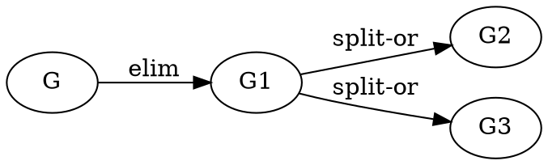
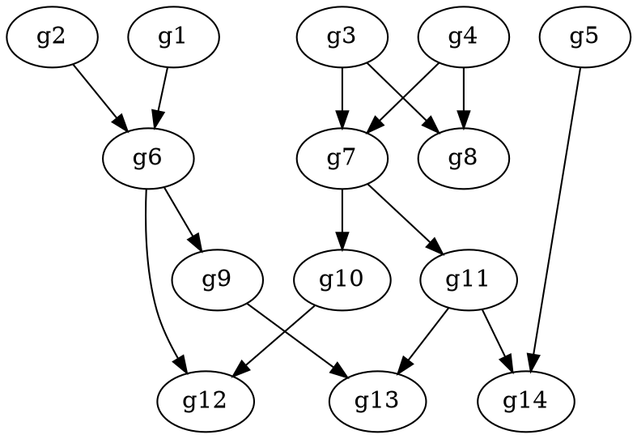

SMT/SAT problems are in general *undecidable*: basically we cannot know
if we can get even an answer. The *search space* is in general infinite.

But several concrete problems have a reduced space and *may be tractable*:
while theoretical really hard, we can find a solution in a reasonable
time.

Still, a solver may need some extra help to navigate across the search
space.

A *strategy* is a *guide* that hopefully will lead to a solution
(`sat` or `unsat`) in a *reasonable time* using a
*reasonable amount of resources*.

It is quite an art and the concepts were around for more than 30 years.

This post is a quick overview of concepts like *strategies*, *tactics*,
*tacticals*, *merit order*, *cost functions*, *heuristic functions*,
*goals*, *approximations*, *redundancy control*, *search strategies*,
*probes* and a few more.

Quite a heavy post I'm afraid.<!--more-->

## Goals

A *goal* is what we want to solve. Depending of the underlying *theory*
this can be:

 - a set of inequations, and we want to see if there is a solution to them.
 - a set of propositional clauses, and want to see if exist
propositional variables to make them true.
 - even a combination of theories are possible.

Let be the *goal set* `{G}`{.mathjax} consisting of a single goal
`G`{.mathjax}:

```tex;mathjax

G: [ a = b + 1, (a < 0 ∨ a > 0), b > 3 ]

```

The goal is to see if
there is an *assignment* for `a`{.mathjax} and `b`{.mathjax} such those inequations hold
or if there is a *contradiction* so it doesn't exist such assignment.

In the first case we say that the such assignment *satisfies* the goal
(the solver returned `sat`); in the second case the problem is
*unsatisfied* (`unsat`).

## Tactics

A *tactic* tries to solve the goal or at least tries to make it easier
to solve.

The tactic `elim`, for example, eliminates intermedian variables such given
`a = b + 1`{.mathjax} the tactic can eliminate `a`{.mathjax} and replace it by
`b + 1`{.mathjax}.

It doesn't solve the problem, but it makes it a little easier to solve
later.

A tactic may have 4 possible results:

 - `sat`: the tactic resolved the goal and returned a *model*, an
*assignment* that satisfies the goal.
 - `unsat`: the tactic found a contradiction and returned a *proof* of
why the goal is `unsat`.
 - `unknown`: the tactic returns a set of *subgoals*,
hopefully being simpler to solve.
 - `fail`: the tactic didn't work.

In this case the tactic `elim` returns `unknown` and the following
1-goal set:

```tex;mathjax

G_1: [ (b + 1 < 0 ∨ b + 1 > 0), b > 3]

```

The tactic `split-or` takes each goal and *splits* the disjunctives
generating a *subgoal* per case. Like before this tactic returns
`unknown` and the subgoals (an ordered set):

```tex;mathjax

G_2: [ b + 1 < 0, b > 3]    \\
G_3: [ b + 1 > 0, b > 3]

```

### Approximations

The tactics may *under-approximate* by changing the initial goal by
another, hopeful simpler, which if it is `sat` then the initial goal is
`sat` too.

An example could be adding more restrictions or assumptions: if the new
*more restrictive* problem is `sat` then the initial is `sat` too. This
is known as *strengthening*.

However, if a *under-approximate* tactic yields `unsat` we cannot say
anything about the initial goal.

The tactics may also *over-approximate* by making a new goal *less
restrictive*: if the new problem is `unsat` then the initial goal is
`unsat` too; if the new problem is `sat` however, we cannot say anything
else.

An example could be removing restrictions or assumptions known as
*weakening*.


## Goals sets

In [2] the returned set by a tactic is in fact two: the set of goals *added* and
the set of goals *deleted* from the initial goal set. The *deleted* set
not only deletes the goals but also *marks* them to make sure they are
not readded later (called *redundacy control* [1])

In [1] the tactic are categorized as *ordering-based* if their input
is a *set of objects* (all the goals) and *subgoal-reduction*
if their input is a *single object* (a single goal).

The first operates over all the goals in each step and it is where
it makes possible to *add* or *remove* goals from the set.

On the other hand the second operates over each goal at time.

> Note: [1] uses *ordering-based* and *subgoal-reduction* to categorize
> *strategies* and not
> *tactics* but it seems reasonable to stretch a little the definition.

### Tactics' products: models and proofs

Note that subgoals `G_2`{.mathjax} and `G_3`{.mathjax} comes from a *disjunctive*:

 - at least one must be true to declare the parent goal `G_1` `sat`
 - all of them must be false to declare the parent goal `G_1` `unsat`

In addition the tactic must build a model from *one* of the subgoal
`sat` and a proof from *all* the subgoals when they are `unsat`.

This is handled by the tactic's *model converter* and *proof converter*
functions, `mc` and `pc` for short.

## Proof graphs / Search graphs

The successive application of tactics generates subgoals that induce a
tree structure know as the *proof tree*:






Formally, to say proof *tree* we need to restrict the tactics to not
generate repeated goals (so we don't have cycles).

Having then a *single* starting goal, the *successive application* of
the tactics forms a *tree*.

We can extend this and have *multiple* starting goals in which case we
will have an *acyclic graph* like described in [3]. (in [3] is more
specific and refers to *goals* and *tactics* as *states* (of a proof)
and *rules of induction* but they are the same idea).






With *subgoal-reduction* tactics, the graph is generated edge by edge;
with *ordering-based* tactics, the graph is generated by multiple edges
at time.

Note that the generation (or walking) of this graph is
non-deterministic: why you would the solver choose to explore the
edge/edges from one node/nodes instead of the other?

To make it deterministic we have a way to *choose* which exploration do
and in which *order*. This is the *search strategy* based on a *merit
order*.

## Search strategy

In [3] it is introduced the notion of *merit order*, a relationship
between every pair of nodes in the graph: `]g_i` ≼ `]g_j`


This *merit order* could have different definitions:

 - `]g_i` ≼ `]g_j` if `]i` ≤ `]j` (a *breadth first* order)
 - `]g_i` ≼ `]g_j` if `]c(g_i)` ≤ `]c(g_j)` for some *cost function*
`]c(n)` ≥ `]0`.
 - `]g_i` ≼ `]g_j` if `]g_i` is in a predecesor layer or level than
`]g_j` (`]g_i` is better than `]g_j` because it required less
applications of tactics)
 - `]g_i` ≼ `]g_j` if `]g_i` is in a successor layer than `]g_j`
(a *depth first* order).


A *search strategy* could use the *merit order* to *schedule* which
goal process next:

 - `]g_i` is processed *before* than *any* `]g_i` that has a worse
merit than `]g_i` (`]g_i` ≼ `]g_j`) *and* worse than any *ancestor*
of `]g_i`.
 - if `]g_i` is generated *before* than `]g_j` then `]g_j` or any of
its ancestors has a worse merit than `]g_i`.

A particular case is when the *merit order* is based on a *cost
function* `]c()` and an *heuristic function* `]h()`.

If `]c(g_i)` is the cost to reach `]g_i`, then `]h(g_i)` *estimates*
the additional cost that would take to go from `]g_i` to a *trivial
goal*, one that is ⊤ (trivially `sat`) or ⊥ (trivially `unsat`).

The estimation can be seen as how much more will take to get to a
final resolution.

`]h()` may *under-estimate* the additional cost or *over-estimate* it.

## Tacticals

While tactics operate at the goal set level, *tacticals* operate one
level higher: they operate with the tactics.

Think in tacticals as functions that receive tactics as their arguments.

`repeat(t)` is a tactical that takes a tactic and applies it several times
until the tactic `fails` so `repeat(elim)` applies `elim` over and over
until no other change happens.

`then(t1, t2)` applies `t1` and if it didn't fail applies `t2`.

`orelse(t1, t2)` applies `t1` and if it failed applies `t2`.

This is a handy way to build the *strategy* to solve the problem in
terms of tacticals and tactics.


## Probes or formula measures

A *probe* or *formula measure* is a tactic which does not modify the
goal set but it fails or not based on attributes or properties of the
current goal set.

A *probe* could count how many variables a formula has or if the
inequations follow are written in a particular way.

Based on a *probe* one tactic or other could be applied next.

For example `orelse(then(c1, t1), t2)` applies `t1` *if* the probe (or
check) `c1` didn't fail otherwise `t2` is applied.

## Reasoning engines

At the end the goals needs to be translated into a suitable format and
sent to the *reasoning engine* for the final resolution.

For example each inequation can be seen as a *propositional variable*
and the problem gets reduced to a SAT problem.

```tex;mathjax

G_2: [ b + 1 < 0, b > 3]    \\
G_3: [ b + 1 > 0, b > 3]    \\
                            \\
G_2 → C_2: [ p ∧ q]    \\
G_3 → C_3: [ r ∧ q]

```

Notice that the conversion was not 1-to-1: `]p` and `]r` could be
`]true` when the original inequations `]b + 1 < 0` and `]b + 1 > 0`
cannot.

The solver then needs to verify if the solution found by the engine is
corrects and make the proper changes to the formulation and try again.

And this is expensive. That's the idea behind the strategy: make the
search space smaller and try to make the conversion from the
arbitrary initial *theory* to the theory supported by the engine.


### Reasoning engines as tactics

If the solver supports more than one reasoning engine, the engine
could be seen as a tactic and which engine to use being determined
by the strategy like any other tactic.

## Strategies

Finally!

A *strategy* is a series of *tacticals* and *tactics* (including the
*reasoning engine* and possibly *probes*)
that combined hope to solve a particular problem: determine if it is
`sat` and get a *model* of it or it is `unsat` and get a *proof* of why.

The *search space* is in general infinite so it is not possible to solve
any arbitrary problem but a strategy may *guide* the search process into
the direction that hopefully will lead to a solution (`sat` or `unsat`)
in a *reasonable time* using a *reasonable amount of resources*.

The search space is generated and explored on each tactic application:
multiple edges at time when a *ordered-based* tactic is used, a single
edge when it is a *subgoal-reduction* tactic.

Adding new goals *expands* the *active* search space; removing goals not
only *reduces* the space but also prevents future tactics to readd the
removed goal offering a *redundancy control*.

The application of the tactics is nondeterministic and an *well founded
order* must prioritize which tactic next.

This is where a *merit order*, a *cost function* and a *heuristic function*
play a role to prioritize.


## References

[0] Moura, L.D., & Passmore, G. (2013). *The Strategy Challenge in SMT
Solving*. Automated Reasoning and Mathematics.

[1] Bonacina, Maria Paola. (1999). *A Taxonomy of Theorem-Proving Strategies*.
10.1007/3-540-48317-9_3.

[2] Bonacina, Maria Paola & Hsiang, Jieh. (1998). *On the Modelling of Search
in Theorem Proving — Towards a Theory of Strategy Analysis*. Information
and Computation. 147. 171-208. 10.1006/inco.1998.2739.

[3] Kowalski, R. (2012). 10 *Search Strategies for Theorem-Proving*.

## Further readings

[4] Plaisted D.A. (1994) *The search efficiency of theorem proving
strategies*. In: Bundy A. (eds) Automated Deduction — CADE-12. CADE 1994.
Lecture Notes in Computer Science (Lecture Notes in Artificial
Intelligence (LNAI)), vol 814. Springer, Berlin, Heidelberg.
https://doi.org/10.1007/3-540-58156-1_5

[5] Bonacina, Maria Paola & Hsiang, Jieh. (1994). *Parallelization of
Deduction Strategies: An Analytical Study*. J. Autom. Reasoning. 13.
1-33. 10.1007/BF00881910.

